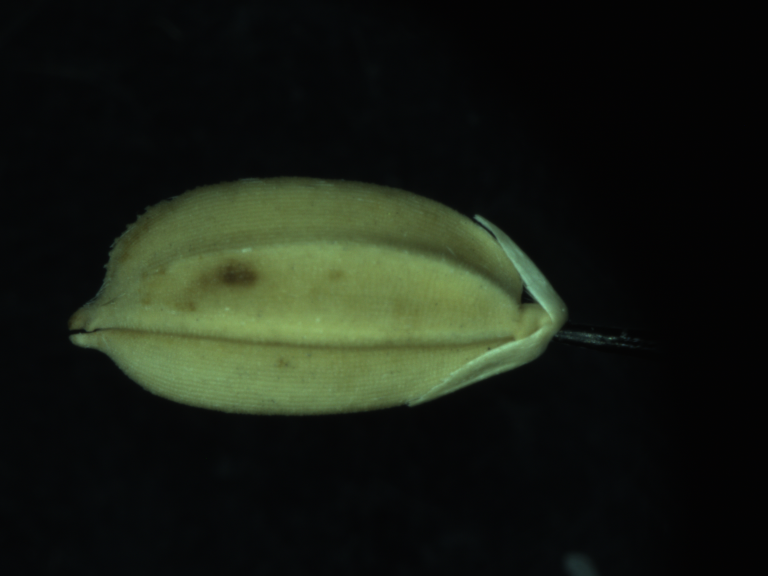
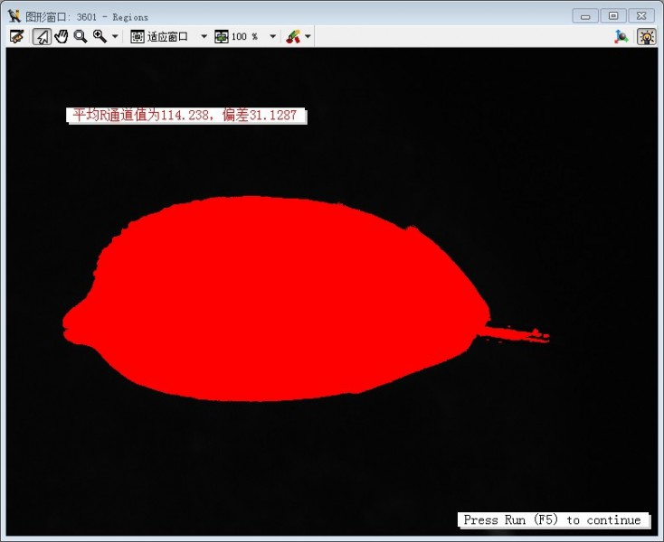
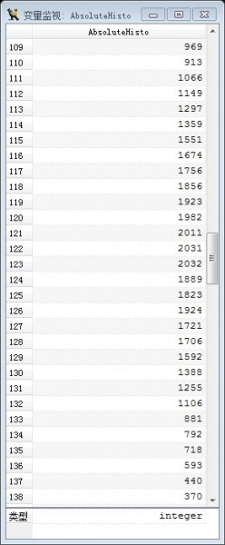

## RGB图像中三个通道的每个灰度值的像素个数

* 群上有位朋友说需要列举RGB图像中三个通道的每个灰度值的像素个数，在这里贴一下代码。 

<pre name="code" class="halcon">

dev_clear_window() 
read_image (Image021,'L:/Halcon test/fruit/pc01.bmp') 
get_image_size (Image021, Width, Height) 
dev_open_window_fit_image (Image021, 0, 0, Width, Height, WindowHandle) 
gen_rectangle2 (ROI_0, 515.6, 935.599, rad(-90), 15.6, 4.8) 
decompose3(Image021, Image021R, Image021G, Image021B) 
rgb1_to_gray(Image021,Image021gray) 
dev_display(Image021R) 
stop() 
gen_rectangle1 (ROI_0, 170.5, 51.5, 426.5, 661.5) 
reduce_domain(Image021R,ROI_0,ImageReduced) 
threshold (ImageReduced, Regions, 11, 152) 
gray_histo(Regions, Image021R, AbsoluteHisto, RelativeHisto) 
intensity(Regions, Image021R, Mean1C021R, Deviation1C021R) 
disp_message (WindowHandle, '平均R通道值为' + Mean1C021R + '，偏差' + Deviation1C021R, 'windows', 70, 70, 'red', 'true') 
disp_continue_message (WindowHandle, 'black', 'true') 
stop()

</pre>

* 区域的像素灰度值平均值 

* AbsoluteHisto变量的部分像素数量。

> [RGB图像中三个通道的每个灰度值的像素个数](https://blog.csdn.net/bitezijie/article/details/24128953)
