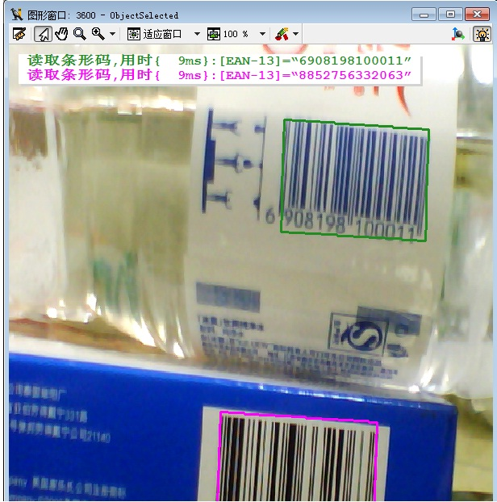

## 分享一个用摄像头获取条形码并显示类型及解码的实例及每个步骤注解

> 获取条形码，并计算及显示解码时间，并从规定读取的条码类型范围中读取被解码的条码类型，也可设置成不规定条码类型即自动识别，但会增加解码时间,甚至出现误读的情况。可读取多个不同类型的条码，并且多个条码用不同颜色的区域框区分，且读取出来的信息也以相应的颜色做区分。

<pre name="code" class="halcon">
dev_close_window ()
dev_open_window (0, 0, 600, 600, 'black', WindowHandle)
* 先关闭活动图形窗口，再打开这个窗口，标识符为WindowHandle；
* 相对于界面左上角第0行、第0列，大小为300×300像素，颜色为黑色。
</pre>

<pre name="code" class="halcon">
open_framegrabber ('DirectShow', 1, 1, 0, 0, 0, 0, 'default', 8, 'rgb', -1, 'false', 'default', 'Gsou USB2.0 Camera', 0, -1, AcqHandle)
* 打开帧接收器（图像采集设备，如摄像头，工业相机等），参数（Parameter）详见这个算子
</pre>

<pre name="code" class="halcon">
grab_image_start (AcqHandle, -1)
while (true)

     grab_image_async (Image, AcqHandle, -1)
     * 开始条形码识别
     create_bar_code_model ([], [], BarCodeHandle)
     * 必备的创建条码解码的开头，下面有一段结束代码
       
       dev_update_var ('off')
       dev_update_pc ('off')
       dev_update_window ('off')
       * 刷新窗体
       
       set_display_font (WindowHandle, 14, 'mono', 'true', 'false')
       dev_set_draw ('margin')
       dev_set_line_width (3)
       Colors := ['forest green','magenta','blue','red','yellow']
       * 设置区域框的属性，如无填充色、边框线大小为3，颜色。
       
       * CodeTypes := ['auto']
       CodeTypes := ['EAN-13','Code 39','EAN-8','Code 128','Code 93']
       * 设置条码的类型，如EAN-13等5种一维码类型，或者auto自动获取（但解码时间较长且有误读的可能）
       
       get_image_size (Image, Width, Height)
       dev_display (Image)
       * 获取图像大小，并显示图像
       
       count_seconds (Start)
       find_bar_code (Image, SymbolRegions, BarCodeHandle, CodeTypes, DecodedDataStrings)
       count_seconds (Stop)
       Duration := (Stop - Start) * 1000
       * 开始计时、寻找并解码条形码（参数解释详见这个算子），结束计时，并计算解码的时间
       
       dev_display (SymbolRegions)
       get_bar_code_object (BarCodeObjects, BarCodeHandle, 'all', 'symbol_regions')
       get_bar_code_result (BarCodeHandle, 'all', 'decoded_types', DecodedDataTypes)
       * area_center (SymbolRegions, Area, Rows, Columns)
       
       for J := 0 to |DecodedDataStrings|-1 by 1
             dev_set_color (Colors[J])
             select_obj (BarCodeObjects, ObjectSelected, J+1)
             dev_display (ObjectSelected)
       endfor
       *循环获取，并且根据获取的条码数量，设置区域框的颜色
     
       if (|DecodedDataStrings| >= 1)
             * disp_message (WindowHandle, ['Found bar code(s) in ' + Duration$'3.0f' + 'ms:','\n Type: ' + DecodedDataTypes + '\n Data: ' + DecodedDataStrings], 'window', 5*12, 12, 'black', 'true')
             disp_message (WindowHandle, '读取条形码,用时{' + Duration$'3.0f' + 'ms}:' + '[' + DecodedDataTypes + ']' + '=' + '“' +  DecodedDataStrings + '”', 'window', 12, 12, Colors, 'true')
             disp_continue_message (WindowHandle, 'black', 'true')
             stop()
       endif
       * 判断读取到数据的数量，当大于1（数字可改为2、3……）个条码被解码时，显示信息在窗体的第12行，第12列的位置，并按顺序用不同的颜色标注
     
     clear_bar_code_model (BarCodeHandle)  
     * 关闭条形码解码
     
endwhile
close_framegrabber (AcqHandle)
* 关闭帧接收器（摄像头）
</pre>

