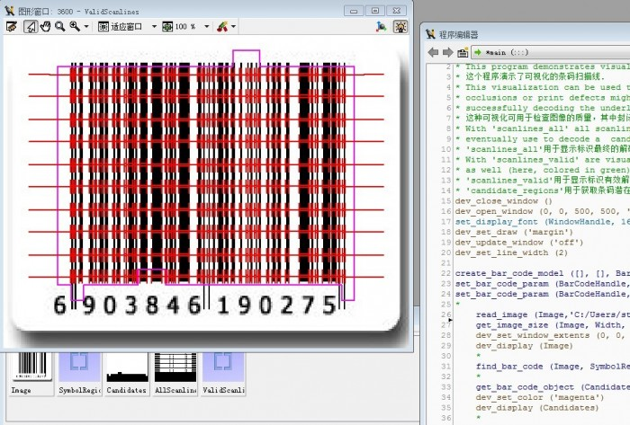
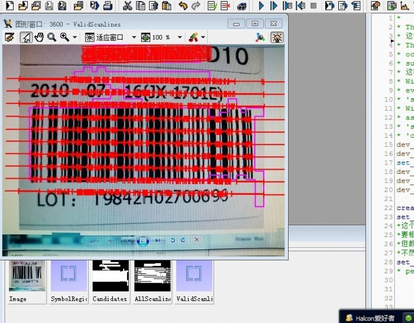
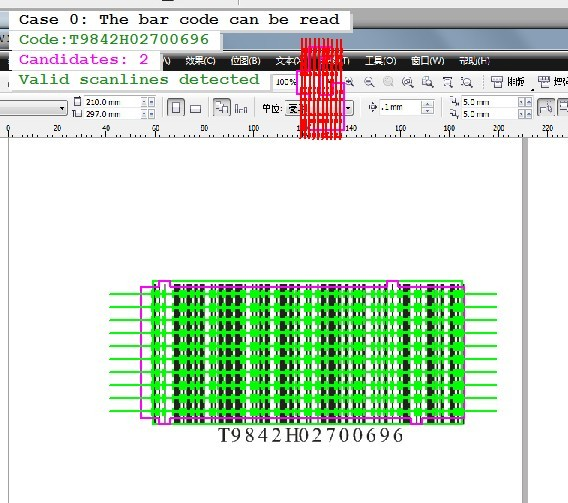

## 分享一段可视化的条码扫描线，用于辨别条码，对判定条码本身是否正确有一定作用。

* This program demonstrates visualization of bar code scanlines.
* 这个程序演示了可视化的条码扫描线.
* This visualization can be used to inspect the quality of images, where
* occlusions or print defects might prevent the bar code reader from
* successfully decoding the underlying bar code.
* 这种可视化可用于检查图像的质量，其中封闭遮断或打印缺陷可能会阻止条形码阅读器成功解码潜在的条码。
* With 'scanlines_all' all scanlines that the bar code reader would
* eventually use to decode a  candidate bar code (here, colored in red).
* 'scanlines_all'用于显示标识最终的解码潜在条码的扫面线（红色部分）
* With 'scanlines_valid' are visualized all scanlines that can be decoded
* as well (here, colored in green)
* 'scanlines_valid'用于显示标识有效解码的扫描线
* 'candidate_regions'用于获取条码潜在区域

dev_close_window () 
dev_open_window (0, 0, 500, 500, 'black', WindowHandle) 
set_display_font (WindowHandle, 16, 'mono', 'true', 'false') 
dev_set_draw ('margin') 
dev_update_window ('off') 
dev_set_line_width (2) 
create_bar_code_model ([], [], BarCodeHandle) 
set_bar_code_param (BarCodeHandle, 'element_size_min', 1.5)

* 这个参数是指条码的条（黑线）和空（空白间隔）的最小宽度，对于尺寸很大的条码，这个最小值element_size_min要相应增加，
* 比如一个较大的条码图片，用1.5可能就读不到，因为条和空的宽度很大，用2或2.5以上就可以解码，但数值越大，解码的时间就越长。
* 还有一个element_size_max的参数，和这个相反，属于限制最大宽度，宽度不能太大，不然相邻的条和空就会被识别成一个了，一般这两个可以一起用。

set_bar_code_param (BarCodeHandle, 'persistence', 1)
* persistence这个参数没有查到，暂未知

read_image(Image,'L:/Halcontest/barcode/test020.jpg') 
get_image_size(Image,Width,Height) 
dev_set_window_extents(0,0,Width,Height) 
dev_display(Image)

find_bar_code(Image,SymbolRegions,BarCodeHandle,'EAN-13',DecodedDataStrings)
* 寻找条码，并获取解码值。

get_bar_code_object(Candidates,BarCodeHandle,'all','candidate_regions') 
dev_set_color('magenta') 
dev_display(Candidates)
* 获取条码的扫描线候选区域。

get_bar_code_object(AllScanlines,BarCodeHandle,'all','scanlines_all') 
dev_set_color('red') 
dev_display(AllScanlines)
* 获取所有的扫描线（扫描线应该是指在一定的高度内读取到的条和空的边缘形成的线），这个读取不论是否能解码，均读取显示。

get_bar_code_object(ValidScanlines,BarCodeHandle,'all','scanlines_valid') 
dev_set_color('green') 
dev_display(ValidScanlines)
* 获取有效的条码扫描线

if(|DecodedDataStrings|>0) 
disp_continue_message(WindowHandle,'black','true') 
stop() 
endif
* if语句，当读到了数值就停下来。

clear_bar_code_model(BarCodeHandle)

### （1）下图是“简单活”提供的原图分析的结果：

* 图1：一个可能错误的EAN-13条码。

### （2）下图是在群里和一位正在做一维码项目的朋友讨论过程的一个分析：

* 图2：她提供的原图分析

### （3）下图我用CoreDraw做的条码值一样的Code128条形码

* 该项目有可能是条码制作时有偏差或错误，或者是工业相机采集时的问题，或其他未知的，还在讨论中。
